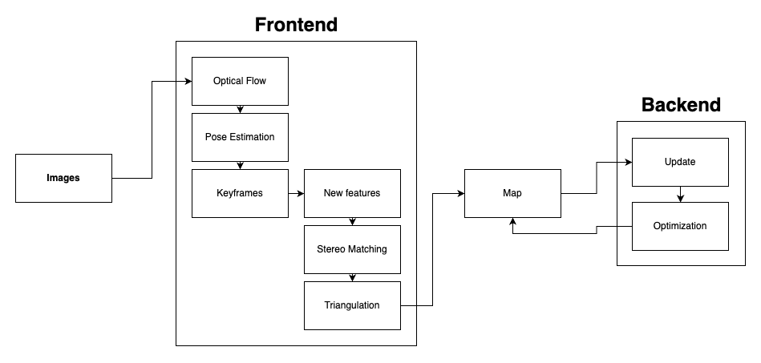

# Stereo Visual Odometry using Kitti Dataset

[](https://opensource.org/licenses/MIT)
[](https://github.com/ayushgoel24/Stereo-Visual-Odometry/issues)
[](https://github.com/ayushgoel24/Stereo-Visual-Odometry)

This repository contains code for implementing Visual Odometry using stereo images from the Kitti dataset. The aim of this project is to estimate the camera motion and generate a trajectory using stereo images.

## Table of Contents
- [Overview](#overview)
- [Pipeline](#pipeline)
- [Key Concepts Used](#key-concepts-used)
- [Edge Cases](#edge-cases)
- [Scope of Improvements](#scope-of-improvements)
- [Dependencies](#dependencies)
- [Usage](#usage)
- [Results](#results)
- [License](#license)
- [Contact](#contact)
- [Acknowledgements](#acknowledgements)

## Overview
Stereo Visual Odometry (VO) is a critical technique in computer vision and robotics that computes the relative position and orientation of a stereo camera over time by analyzing the two successive image frames. The primary advantage of stereo VO is its capability to gain depth perception, making it more robust in various scenarios as compared to its monocular counterpart.

In this repository, we delve deep into the world of stereo VO, understanding its nuances and implementing a simplified yet effective version. We specifically target its application on the Kitti dataset to witness its efficacy and robustness.

The core philosophy behind opting for stereo VO stems from two pivotal reasons:

Ease of Implementation: Stereo vision, despite its profound capabilities, is surprisingly straightforward to actualize. A distinct advantage is the potential to initialize in just a single frame, thereby making the overall process swift and efficient.
3D Observation Prowess: Unlike monocular cameras, which can struggle with depth perception, stereo cameras inherently possess the capability to observe in 3D. This 3D observation significantly amplifies the overall accuracy of the system, especially in scenarios with varying depths.
We've structured our implementation around a frontend-backend architecture. The frontend focuses on the optical flow tracking— a method that gauges how points in a scene move or the apparent motion of objects in the visual scape. In contrast, our backend is geared towards bundle adjustment (BA), an optimization technique that refines camera parameters and 3D points to minimize reprojection errors.

Diving into the architecture, our codebase has been organized in line with standard practices for small algorithm libraries, ensuring that users can intuitively understand and navigate the various components of our stereo VO implementation.

We invite you to explore, experiment with, and enhance this stereo VO project. Your journey begins here!

## Pipeline


## Key Concepts Used

1. Lucas-Kanade Optical Flow: Optical flow is used for feature tracking in the stereo images. The Lucas-Kanade algorithm is employed to estimate the motion of features between consecutive frames.

2. GFTT (Good Features to Track): The GFTT algorithm is used for feature extraction. It identifies key points in the image that can be tracked across frames.

3. Multi-Threading and Mutexes: Multi-threading and mutexes are utilized to optimize the performance of the algorithm. This allows for parallel processing and efficient synchronization of data.

## Edge Cases

The following edge cases have been handled in the implementation:

- [x] Handling the case where the number of active keyframes exceeds a predefined limit.
- [ ] Adaptation to changes in brightness settings.
- [ ] Recovery when tracking is lost.

## Scope of Improvements

There are several areas where the code can be improved and extended:

1. Comparison of Feature Extraction Algorithms: In addition to GFTT, it would be beneficial to compare other feature extraction algorithms such as ORB and SIFT. This can help determine the most suitable algorithm for feature detection in different scenarios.

2. Parameterized Optimization Methods: The performance of the odometry algorithm can be further improved by experimenting with different optimization methods and parameters. This would involve comparing the results achieved by varying optimization techniques.

3. Comparison with Other Feature Tracking Algorithms: Apart from Lucas-Kanade, there are various other feature tracking algorithms available. Comparing the performance of different algorithms can provide insights into their strengths and weaknesses.

4. Quantification of Results: To evaluate the accuracy and reliability of the visual odometry system, it would be helpful to quantify the results. This can be achieved by comparing the estimated trajectory with ground truth data and calculating metrics such as error metrics (e.g., RMSE) and trajectory similarity measures (e.g., Dynamic Time Warping).


## Dependencies

## Usage

To build the code, follow these steps:

1. Navigate to the root directory of the project:
   ```
   cd ~/ws
   ```

2. Create a build directory:
   ```
   mkdir build
   ```

3. Enter the build directory:
   ```
   cd build
   ```

4. Generate the build files using CMake:
   ```
   cmake ..
   ```

5. Compile the code:
   ```
   make
   ```

To run the code on the KITTI dataset, execute the following command:

```
cd ~/ws
bin/run_kitti_stereo
```

Ensure that the KITTI dataset is properly configured and accessible in the expected directory structure for the code to run successfully.

## Results

### Output will be like

```
0204 14:58:25.402386 29886 visual_odometry.cpp:41] VO is running
I0204 14:58:25.413861 29886 frontend.cpp:265] Find 130 in the last image.
I0204 14:58:25.415143 29886 frontend.cpp:211] Outlier/Inlier in pose estimating: 16/88
I0204 14:58:25.415163 29886 frontend.cpp:216] Current Pose = 
000.559344 0-0.798614 000.222148 00-25.5681
000.825838 000.560017 0-0.066126 00-302.885
-0.0715975 000.220446 000.972768 00-356.362
0000000000 0000000000 0000000000 0000000001
I0204 14:58:25.420295 29886 visual_odometry.cpp:62] VO cost time: 0.00845767 seconds.
```

### Output GIF of the visual odometry


## Things to take care of
1. Use 3rd party libraries for version compatibility
2. May need to run commands (or add in .bashrc):
```
export LD_LIBRARY_PATH=$LD_LIBRARY_PATH:/usr/local/lib
export LD_PRELOAD=/usr/lib/x86_64-linux-gnu/libffi.so.7
```

## License

This project is licensed under the [MIT License](LICENSE).

## Contact

For any inquiries or questions, please contact [ayush.goel2427@gmail.com].

Happy coding!